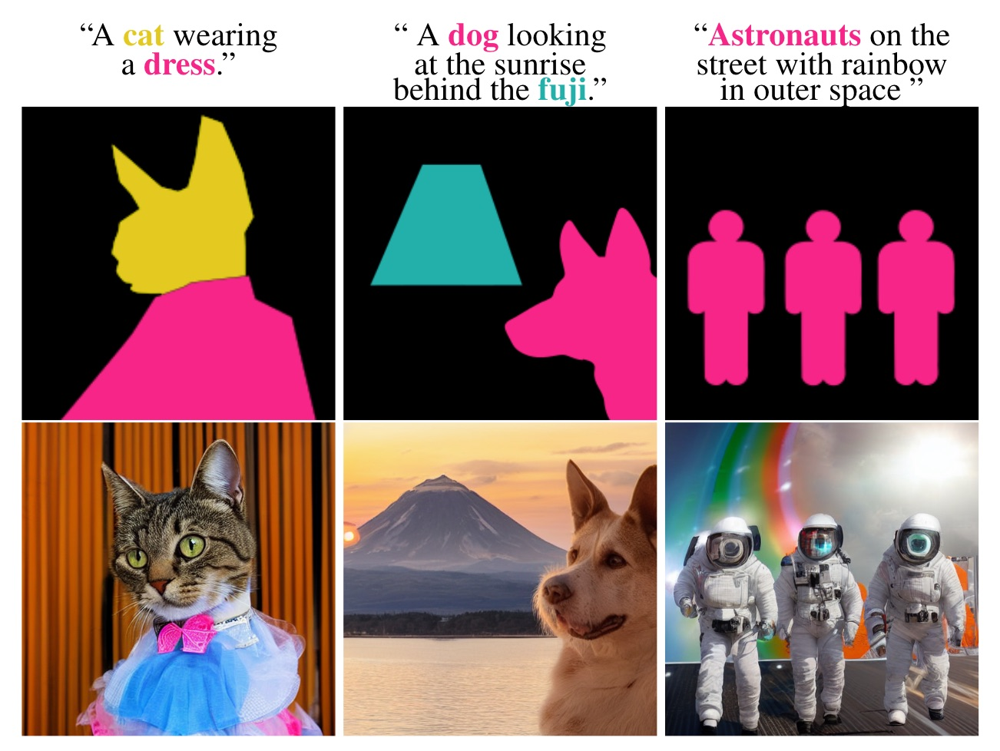
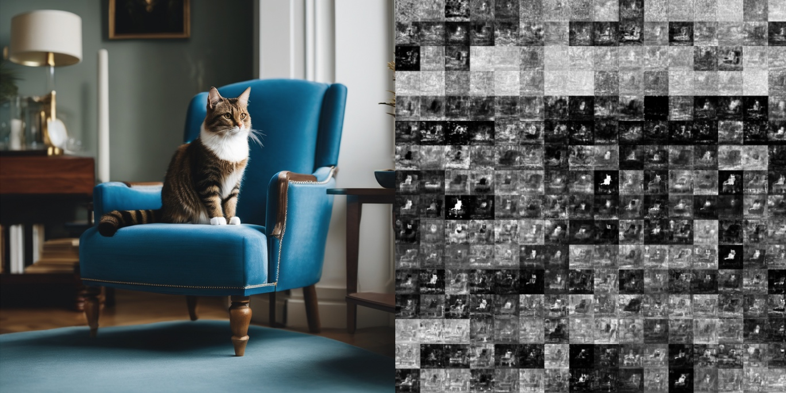
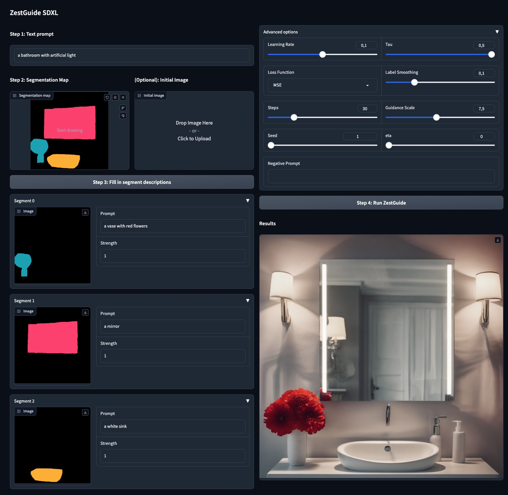

# ZestGuide: Zero-shot layout conditioning for text-to-image diffusion models (ICCV 2023)

Code for running [ZestGuide](https://arxiv.org/abs/2306.13754) (ICCV 2023) on Stable Diffusion XL.
ZestGuide allows to generate images conditioned on a text prompt and a text-labelled segmentation map, *without any fine-tuning*.



# Intro

Paint with words does not work well on Stable Diffusion-XL ! Indeed, there are a lot more attention maps and very few of them are really meaningful. Below is shown a sample from StableDiffusion XL (prompt: *"a cat on a blue chair, in a living room"*), and on the right are shown the attention maps.



However, the good attention maps can be used to perform classifier guidance, with ZestGuide.


# Usage

```python
from functools import partial
from zestguide_utils import mse_loss2
import torch

from zestguide_pipeline import ZestGuidePipeline
inpaint_pipe = ZestGuidePipeline.from_pretrained(
    "stabilityai/stable-diffusion-xl-base-1.0", torch_dtype=torch.float16)

gen = torch.Generator()
gen.manual_seed(1)


mask = torch.zeros((1024, 1024))
mask[256:-256, 384:-384] = 1
mask[256:-256, -384:-112] = 2

idx2words = {1: "cat",
             2: "chair"}

prompt = "a cat on a blue chair, in a living room"

input = dict(caption=prompt,
             idx2words=idx2words,
             mask=mask)

out = inpaint_pipe(prompt=input['caption'], 
         segmentation_mask=input['mask'].int(),
         idx2words=input['idx2words'],
         generator=gen,
         guidance_scale=7.5,
         num_inference_steps=50,
         concat_words_to_prompt=True,
         eta=0.,
         lr=1e-1,
         loss=partial(mse_loss2, ls=0.2),
         ediffi_coeff=0,
         n_attention_maps=20,
         show=True,
        tau=0.4).images[0]

```

# Gradio Demo

The gradio demo is heavily inspired from this [Paint with words demo](https://github.com/cloneofsimo/paint-with-words-sd/).

```python
python gradio_zestguide.py
```



# Evaluation

## Generate images from cocostuff dataset

Modify configs/zestguide.yaml with the correct parameters (data path,...)


Launch an experiment with:
```python
python generate_dataset.py configs/zestguide.yaml --output generated/zestguide 
```
You can optionally launch several jobs in parallel with the argument `--submitit`.
`generate_dataset.py` will save generated images in a subfolder of `generated/zestguide` called `images`. 


## Generate segmentation maps from synthesized images

Once all images are generated, `generate_dataset.py` will also call a script which will compute segmentation maps of synthesized images using ViT-Adapter in a subfolder called `pred_label`.
In order to make it work correctly, you need to install ViT-Adapter and its conda environment described in `ViT-Adapter/segmentation`.
```sh
git clone https://github.com/czczup/ViT-Adapter.git
```
You should also copy the file `segmentor/segment_with_vitadapter.py` in `ViT-Adapter/segmentation` and complete the bash script `segmentor/segment_with_vitadapter.sh` with the correct paths.

## Compute metrics
Finally, you can evaluate the model on FID, CLIP and mIoU scores with the following script:

```python
python evaluate.py generated/zestguide --dataset coco1024
```
We use the library [cleanfid](https://github.com/GaParmar/clean-fid) to compute FID, and we provide the fid stats of coco located in `data/fid_stats` so that you can copy them in the `stats` folder of cleanfid library package.


# Acknowledgements

The gradio interface is heavily inspired from [this repository](https://github.com/cloneofsimo/paint-with-words-sd/)

# Citation

If you use this code for your research, please cite

```
@inproceedings{couairon2023zero,
  title={Zero-shot spatial layout conditioning for text-to-image diffusion models},
  author={Couairon, Guillaume and Careil, Marl{\`e}ne and Cord, Matthieu and Lathuili{\`e}re, St{\'e}phane and Verbeek, Jakob},
  booktitle={Proceedings of the IEEE/CVF International Conference on Computer Vision},
  pages={2174--2183},
  year={2023}
}
```
